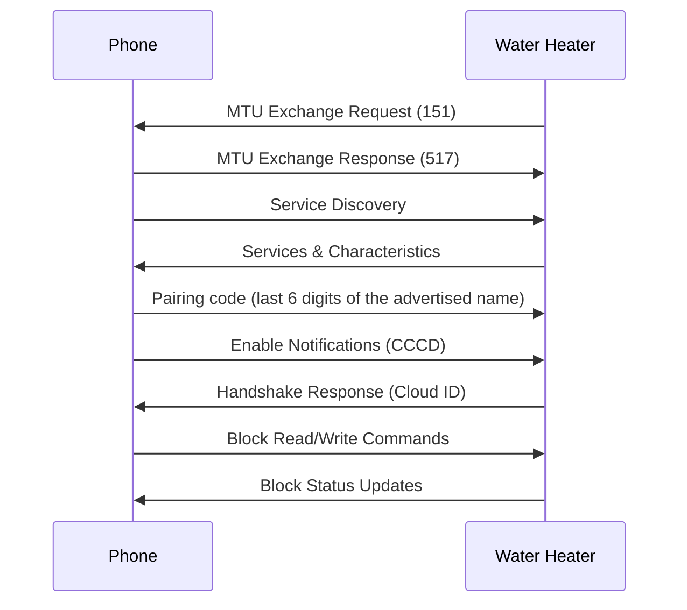

# Connection

How a client reaches the heater over Bluetooth LE: services, MTU, framing and client stack requirements.

## Connection overview



The diagram shows the official app's order: pairing code first, then notifications. Subscribing first also works (**verified on hardware**); whether order matters is **unverified**. The handshake is in [Handshake](handshake.md).

**MTU negotiation** (verified on hardware, from Android HCI captures):

- Device request: 151 bytes
- Phone response: 517 bytes
- Effective MTU: 151 bytes (the minimum of the two)

Only one central can connect at a time, so the official app and another client cannot be connected together.

## Service discovery

### Primary services

| Service          | UUID                                   | Handle range  |
| ---------------- | -------------------------------------- | ------------- |
| GAP              | 0x1800                                 | 0x0001-0x0009 |
| GATT             | 0x1801                                 | 0x000a-0x000d |
| Custom Service 1 | `69400001-b5a3-f393-e0a9-e50e24dcca99` | 0x000e-0x0013 |
| Custom Service 2 | `7f510004-b5a3-f393-e0a9-e50e24dcca9e` | 0x0014-0xffff |

### Key characteristics

| Handle | UUID                                   | Properties               | Purpose                      |
| ------ | -------------------------------------- | ------------------------ | ---------------------------- |
| 0x0010 | `69400003-b5a3-f393-e0a9-e50e24dcca99` | Write, Write No Response | **TX (phone to device)**     |
| 0x0012 | `69400002-b5a3-f393-e0a9-e50e24dcca99` | Notify                   | **RX (device to phone)**     |
| 0x0013 | 0x2902 (CCCD)                          | Read, Write              | Enable/disable notifications |

TX and RX are named from the client's perspective. Handle `0x0013` is the CCCD of RX.

The service UUID is not advertised, see [Captures](../research/captures.md#advertising-result).

## Message framing

Every message, in either direction, has the same outer frame (parameters are addressed by block, see [Blocks](blocks.md)):

```text
+----------+----------+--------+--------------+---------+
|  Header  |   Type   | Length |     Data     |   CRC   |
| (1 byte) | (1 byte) |(1 byte)|  (N bytes)   | (1 byte)|
+----------+----------+--------+--------------+---------+
```

**Message direction:**

- `0xBD` = phone to device (commands)
- `0xDB` = device to phone (responses)

**CRC:** see [CRC](crc.md).

## Client requirements

### The client must answer the Exchange MTU Request

The heater sends an ATT Exchange MTU Request on every connection. A client must answer it. If the client never replies, the heater still accepts writes (ATT Write Responses come back normally) but never sends a single notification (**verified on hardware**).

### Practical notes

- A stale BlueZ connection can block discovery. Run `bluetoothctl disconnect <mac>`.
- The Bluetooth signal stays active for 10 minutes after a button press, then stops if no pairing is attempted (**from the handbook**). The heater going quiet after about 10 minutes idle and needing another press to advertise is a related observation (**unverified** as an exact figure).
